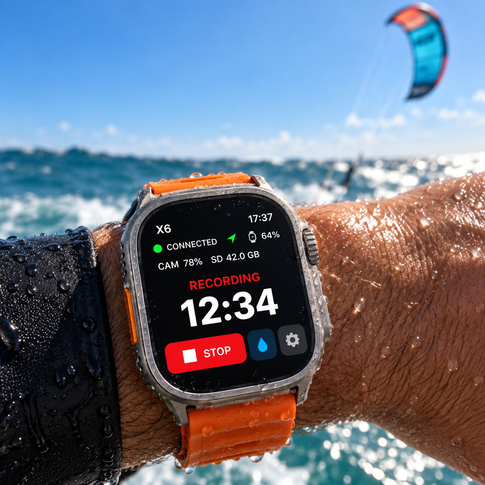
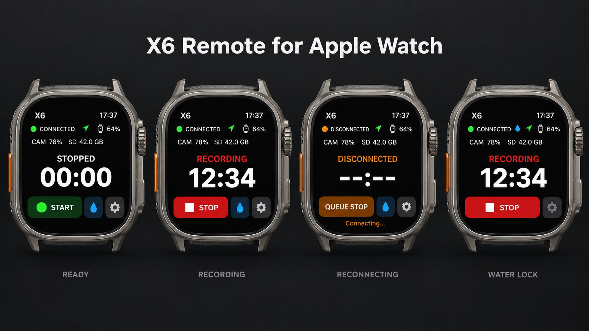

# X6 Remote for Apple Watch

An Apple Watch remote for the **Insta360 X6** that connects to the camera directly
over Bluetooth, reconnects by itself, and can be used in the water with the
**Action button** and **Water Lock**. Built for kitesurfing, wing foiling and
surfing, but it works for anything where you can't touch the screen.

> Independent hobby project. **Not affiliated with, endorsed by or supported by
> Insta360.** The camera's Bluetooth protocol was worked out independently. Use at
> your own risk, and check your camera before relying on it.

  

## Why this app exists

I wanted to start and stop my X6 from the Watch while riding. With the official
Insta360 Watch app, that didn't work for me on the water:

- **No automatic connection or reconnection.** When the camera dropped out of
  range (for example underwater, or the board/helmet moved away), I had to
  reconnect by hand on the screen.
- **Not usable in the water.** Everything depends on the touchscreen, which
  doesn't work reliably when wet, and Water Lock disables touch completely.

X6 Remote is designed around those problems: it connects and reconnects on its
own, it is controlled with the physical Action button, and it keeps running next
to a sports-tracking app.

## Features

### Camera control
- **Direct Bluetooth connection** from the Watch to the camera. The iPhone is not
  needed while you use it.
- **Automatic setup:** on first launch it finds a nearby X6 and remembers it.
  After that it only ever connects to that saved camera.
- **Automatic reconnection** after the camera goes out of range or underwater.
- **One large START/STOP button.** Recording is only shown as started or stopped
  after the camera itself confirms it, never just because a button was pressed.
- **Recording time from the camera,** plus **camera battery**, **SD card free
  space** and the **Watch battery** on one screen.

*Images are illustrations (generated renders), not photos or real screenshots. Values shown are examples.*

### Hands-free control
- **Action button** (Apple Watch Ultra) through Shortcuts actions:
  - **Open X6 or Toggle Recording** (recommended): opens X6 Remote; if the camera
    is connected, starts or stops recording. If it is still reconnecting, the
    press only opens the app; press again once connected.
  - **Toggle X6 Recording**, **Start X6 Recording**, **Stop X6 Recording**,
    **Read X6 Recording State**.
- **Double Tap** (Apple Watch Series 9 / Ultra 2 and later) presses START/STOP
  while X6 Remote is on screen. Can be turned off in Settings.
- **Distinct vibrations** for recording started, stopped, STOP queued and failure.
- **Queued STOP:** a STOP pressed while the camera is disconnected is sent as soon
  as it reconnects. START is never queued, so a camera never starts recording
  unexpectedly later.

### On the water
- **Riding session:** when you open X6 Remote it starts a background location
  session. This keeps the app running and connected while another app, such as a
  workout tracker, is also running, and lets the Watch return to X6 Remote. It
  does not end the other app's workout. It ends when you tap **End riding
  session** or 4 hours after you last opened the app. Location is only used to
  keep the app running; it is never stored or sent anywhere.
- **Water Lock button** on the main screen while the riding session runs. Hold
  the Digital Crown to unlock, as usual.
- **Optional status notifications** when another app is on screen.

### Diagnostics
- **Last command report** and **Last failed command**: step-by-step record of the
  latest command and the latest failure, kept on the Watch.
- **Detailed logging** (off by default) for connection troubleshooting.
- Nothing is sent over the network; there are no analytics.

## Safety design

- The camera's state is always read before a command. If the state is unknown,
  the app refuses to toggle and asks you to check the camera.
- START and STOP are never sent twice automatically. If a reply is lost, the app
  only reads the camera's state again.
- A camera reply alone does not count as success; the recording state must change.

## Tested with

| | |
|---|---|
| Camera | Insta360 X6, firmware 1.1.7, normal video mode |
| Watch | Apple Watch Ultra, watchOS 26 |
| iPhone | iOS 26 / 27 |

Other Insta360 models (X4, X5 …) are **not supported yet**. They may use a
different message format; see [docs/PROTOCOL.md](docs/PROTOCOL.md). Contributions
from people with those cameras are welcome.

## Installing

There is no App Store or TestFlight version. You build and install it yourself.
Apps signed with a free Apple account stop launching after 7 days and must be
reinstalled; a paid developer account extends this to a year.

### With a Mac and Xcode
1. Install Xcode 26 or later.
2. Copy `apple/Local.xcconfig.example` to `apple/Local.xcconfig` and enter your
   Apple team ID and a bundle identifier of your own.
3. Open `apple/X6Remote.xcodeproj`, select the **X6RemotePhone** scheme and your
   iPhone, and run. The Watch app is installed together with the iPhone app.

### Without a Mac (GitHub Actions)
1. Fork this repository.
2. In your fork, open **Actions → Build X6 Watch IPA → Run workflow**.
3. Download the unsigned IPA from the finished run.
4. Sign and install it with a sideloading tool that supports embedded Watch apps.

### Set up the Action button
1. On the iPhone, open **Shortcuts** and create a shortcut with the action
   **Open X6 or Toggle Recording**.
2. In the shortcut's details, turn on **Show on Apple Watch**.
3. On the Watch: **Settings → Action Button → Shortcut**, then pick it.

## Using it on the water

1. Switch the camera on and open X6 Remote. Allow location the first time (for
   the riding session). Wait for **CONNECTED**.
2. Start your sports-tracking app, then switch back to X6 Remote so it is the
   app on screen.
3. Tap the blue drop button to turn on Water Lock.
4. Press the Action button to start recording, and again to stop. The Watch
   vibrates when the camera confirms.

Test everything on land first.

## Development

- `apple/WatchApp`: Watch app (SwiftUI, Core Bluetooth, App Intents).
- `apple/PhoneApp`: small iPhone companion that makes the actions available in
  Shortcuts. It never talks to the camera.
- `apple/Packages/X6Core`: protocol, command and state logic with unit tests.
  Runs on macOS, Windows and Linux: `swift test --package-path apple/Packages/X6Core`.
- `apple/verify-mac.sh` / `apple/verify-windows.ps1`: full local checks.
- `docs/PROTOCOL.md`: what is known about the camera's Bluetooth protocol.

## Support

X6 Remote is free and open source. If it helps you on the water and you'd like
to say thanks, you can buy me a coffee on **[Ko-fi](https://ko-fi.com/andreys)**.
Bug reports and pull requests are just as welcome.

## License

[MIT](LICENSE). Third-party notices: [THIRD_PARTY_NOTICES.md](THIRD_PARTY_NOTICES.md).
Insta360 and X6 are trademarks of their owner and are used here only to describe
compatibility.
